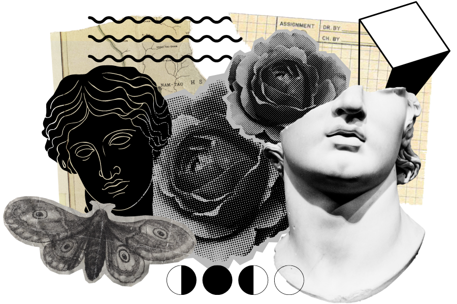

_Die Wunderkammer_: A "wonder room", a "cabinet of wonders", or "cabinet of curiosities". Whatever you want to call it, it's a fancy way of saying a room or cabinet full of cool junk. Wikipedia sez:

> _...these cabinets served as entertainment, as particularly illustrated by the proceedings of the [Royal Society](https://en.wikipedia.org/wiki/Royal_Society "Royal Society"), whose early meetings were often a sort of open floor to any Fellow to exhibit the findings his curiosities led him to. However purely educational or investigative these exhibitions may sound, it is important to note that the Fellows in this period supported the idea of "learned entertainment," or **the alignment of learning with entertainment.**_

Consider this a hypertext _wunderkammer_ of yet another stranger on the Internet. I will ramble on about, in particular order, things like: self-led learning, unschooling and other forms of alternative schooling for kids, parenting, books & the art of reading, philosophy, creativity, and pretending to be a writer, among other things. I don't know if you'll like it here, and truthfully I write better if I think no one is watching. Go ahead and crack open the doors, but do it quietly...